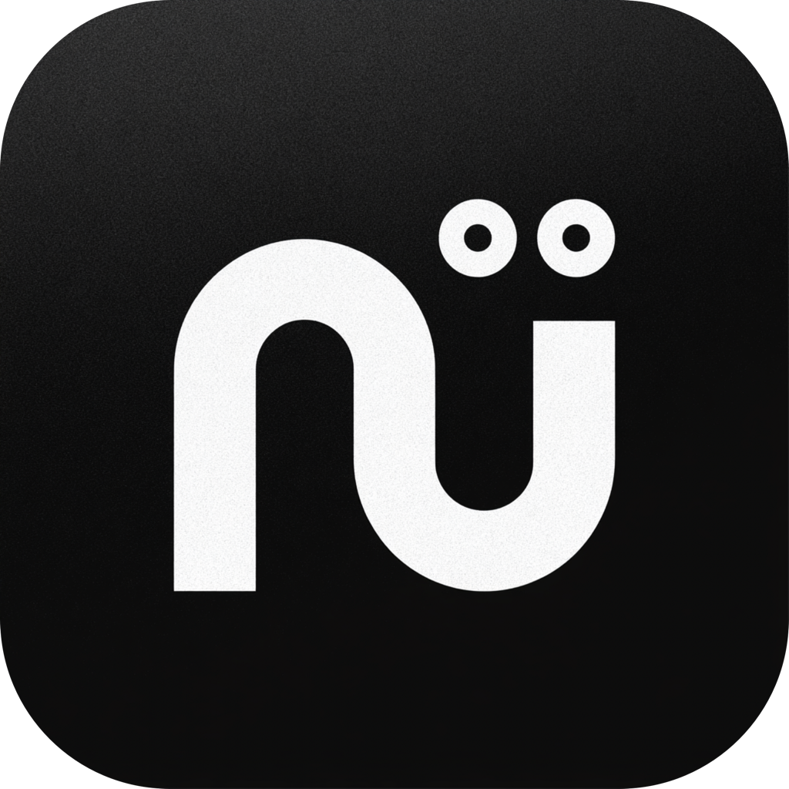
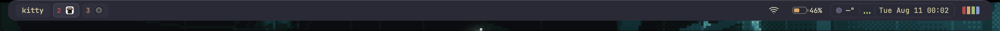
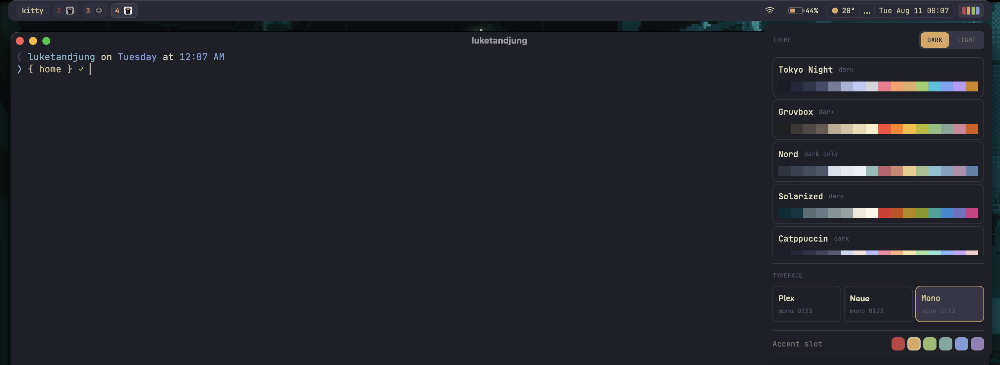
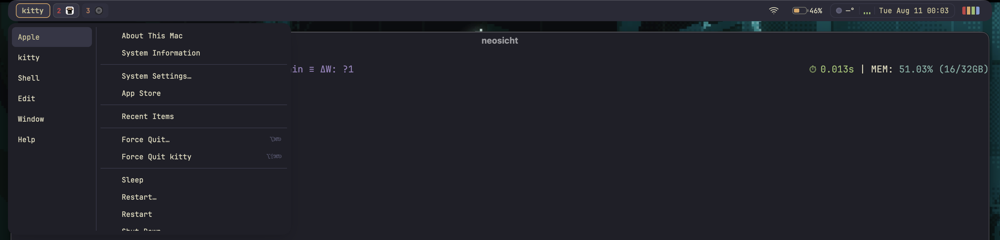

<div align="center">



# Neosicht

**A themeable, GPUI-native desktop shell bar for macOS.**

[](LICENSE)
[](#requirements)

</div>

Neosicht keeps WindowServer and normal macOS applications while replacing visible shell chrome with a compact top bar. It combines AeroSpace workspaces, application menus, Wi-Fi, battery, weather, music, calendar, and persistent Base16 themes in one native GPUI panel.

## Preview



<details>
<summary>Theme popover</summary>



</details>

<details>
<summary>Application menu popover</summary>



</details>

Additional panels include live application menus, Wi-Fi networks and joining, weather, music controls, calendar events, and more.

> [!IMPORTANT]
> Neosicht is under active development and currently targets Apple silicon Macs. It uses macOS Accessibility, Location, Calendar, and Automation permissions for the corresponding widgets.

## Features

- AeroSpace workspace and application tiles
- Accessibility-backed menus for the foreground application
- Live Wi-Fi, battery, weather, calendar, Spotify, and Apple Music controls
- Persistent Base16 themes, accents, appearance, and fonts
- A single transparent macOS panel with native Swift adapters behind narrow C ABIs
- Reproducible Nix application packaging

## Requirements

- macOS 14 or newer on Apple silicon
- [AeroSpace](https://github.com/nikitabobko/AeroSpace)
- Xcode Command Line Tools when installing with Cargo

## Installation

### Homebrew

```bash
brew tap LukeTandjung/tap
brew install --cask neosicht
open -a Neosicht
```

Upgrade later with:

```bash
brew upgrade --cask neosicht
```

### Nix

Run the packaged application without installing it:

```bash
nix run github:LukeTandjung/neosicht
```

Or build the `.app` bundle:

```bash
nix build github:LukeTandjung/neosicht#neosicht
open result/Applications/Neosicht.app
```

For nix-darwin, add the flake input and package to your configuration:

```nix
{
  inputs.neosicht.url = "github:LukeTandjung/neosicht";

  outputs = { nixpkgs, neosicht, ... }: {
    darwinConfigurations.your-host = nix-darwin.lib.darwinSystem {
      modules = [
        ({ pkgs, ... }: {
          environment.systemPackages = [
            neosicht.packages.${pkgs.system}.neosicht
          ];
        })
      ];
    };
  };
}
```

### Cargo

```bash
cargo install --git https://github.com/LukeTandjung/neosicht --package neosicht
neosicht
```

Cargo installs the executable rather than a macOS `.app` bundle. Homebrew or Nix is recommended for normal desktop use and stable macOS permission identity.

## Permissions

Enable Neosicht under **System Settings → Privacy & Security** for the features you use:

- **Accessibility** — foreground application menus
- **Location Services** — weather and Wi-Fi scanning
- **Calendars** — upcoming events
- **Automation** — Spotify and Apple Music controls

## Development

Enter the development environment and run the shell:

```bash
direnv allow
cargo run -p neosicht
```

Run the complete validation suite:

```bash
devenv tasks run project:check
devenv tasks run project:test
nix build .#neosicht
```

See [`docs/PLAN.md`](docs/PLAN.md) for the product and architecture plan and [`docs/EXPERIMENTS.md`](docs/EXPERIMENTS.md) for native integration findings.

## Architecture

Each product feature is a cohesive Rust crate. Pure state and decisions live in `core`, application-owned capabilities in `ports`, Apple and external integrations in `adapters`, and polling/task ownership in `impls`. Swift contains framework objects and exposes only narrow C-compatible boundaries to Rust.

## Project relationships

Neosicht is an independent community project. It is not affiliated with or endorsed by Apple, AeroSpace, GPUI, Spotify, or Nix.

## License

[MIT](LICENSE)
